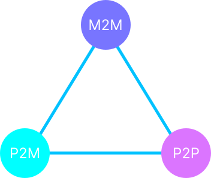

# Prise de note - ioe - N01

### Relation entre humain et machine.

1. M2M: Machine to Machine
2. P2M: Person to Machine
3. P2P: Person to Person

### Internet

Internet: Reseau des reseaux, interconexion de beacoup de reseaux entre eux.

### Appareils connectes

#### Capteur

Capteur: Permet de renvoyer des donnes par rapport a son environnement.

#### Pour qui sont les donnes des capteurs ?

- Businesse
- Gouvernements
- Villes