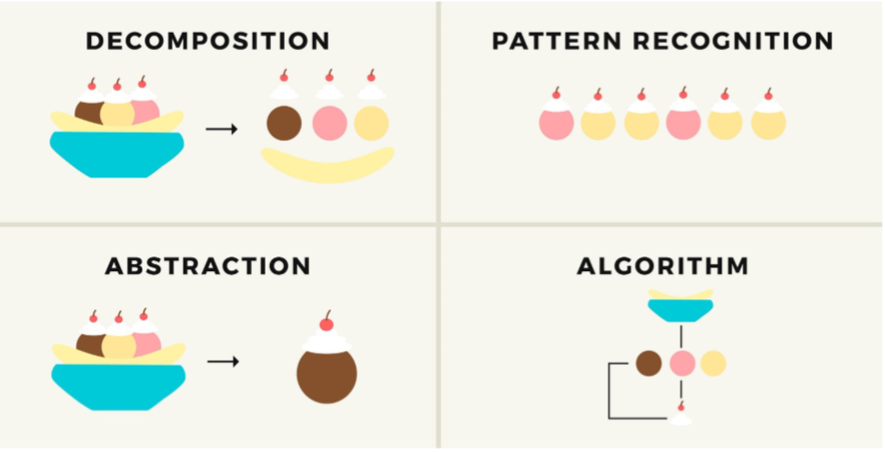

# Some Definitions

## Termes en general

- Programme: Ensemble d'instruction et d'operation destinee a etre executees par un ordinateur

- Programme/code binaire: Description des instructions a executer par processeur sous forme numerique, elles definissent un language machine.

- Assembleur: Language le plus proche de la machine

- Code source: Code ecrit dans un language de programmation par un programmeur.

- Interpreteur: Transforme le code source en binaire lors de l'execution du programme, en live

- Compileur: Transforme le code source en code binaire executable, si une modification est fait au code, il faut recompiler.

- Programmation: Toutes le etapes qui entoure et font partie de l'ecriture du code (Testing, Integration, Analyse, ...)

- Algorithme: Moyen de resoudre un probleme de maniere systematique. Transformation d'une solution en language parler en code comprehensible par la machine.

## Computational thinking

1. Decomposition (du probleme)
2. Patern Recognition (dans le probleme)
3. Abstraction (on ne pense pas au code)
4. Algorithm (on pense a la logique en code)

## Paradigmes de programmation

- Imperative: code qui s'execute ligne apres ligne
- Declarative: tout instruction est previsible a l'avance et donne toujours le meme resultat (HTML)
- Oriante Objet: Utilisation de classe/objet

## Les valeurs et les variables

- Declaration: Creation d'une variable. `int i;`
- Initialisation: Affectation d'une valeur lors de la **Declaration de celle-ci** `int i = 3;`
- Affectation: Donner ou modifier la valeur d'une variable existante `i = 3; i += 1; ...`

## Specification d'un probleme

1. Parametres d'entree: les valeurs que l'on a au debut d'un probleme.
2. Pre-condition: verification que les valeurs d'entree sont correcte au probleme.
3. Parametres de sortie: reponse au probleme.
4. Post-condition: Verification que la reponse donnee est correct.

## Trois regles d'un algorithme

- Terminaison: A une fin.
- Correction: Repond au probleme
- Completude: Donne toujours la bonne reponse, meme en changeant les valeurs initales

## Structures

### Controle
- Sequence
- Conditionnel
- Boucle

### Donnees
- Constantes
- Variables
- Tableaux
- Listes

