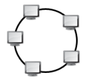
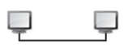
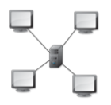
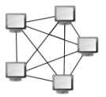
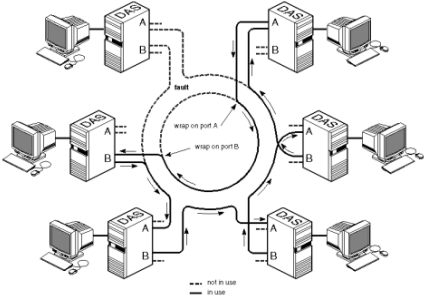
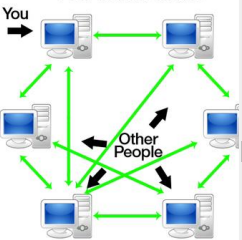

# Prise de note - reseau - N02

### Les Réseaux

Réseaux : Ensemble d’équipements/logiciels qui communiquent entre eux via des émetteurs-récepteurs.

### Types de réseaux

| Acronyme | Nom complet               | Distance       |
| -------- | ------------------------- | -------------- |
| PAN      | Personal Area Network     | ~ 1m -> 10m    |
| LAN      | Local Area Network        | ~ 10m -> 1km   |
| MAN      | Metropolitan Area Network | ~ 1km -> 100km |
| WAN      | Wide Area Network         | + 100km        |

- Réseau de diffusion : un support de transmission, partagé par tous les équipements, envoyé une fois et reçu par tous.

- Réseau point-à-point : un seul support de transmission relie deux équipements, ils communiquent via des équipements intermédiaires.

- Réseau unicast : deux machines connectées l'une à l'autre.

### Topologies Réseau

#### Bus

#### Anneau

#### Point à Point

#### Étoile

#### Maillé

#### FDDI

> Deux anneaux de fibres optiques.

#### Peer to Peer (P2P)

#### Type de connexion Internet

- L’infrastructure réseau nécessite au moins 3 composants : Périphériques, support de transmission, les services/processus.

- NIC = carte réseau = Network Interface Card

- Ligne commutée (ancienne) < xDSL < Fibres

### xDSL

- xDSL = DSL x 

- ADSL (Asymmetric DSL) < VDSL (Very-high-bit-rate DSL) < VDSL2 < SDSL

#### Fibres

- FTTx = fibres x 

- FTTN (Neighbourhood) < FTTC (Curb) < FTTB (Building) < FTTH (Home)