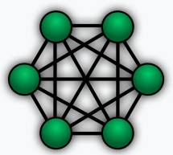
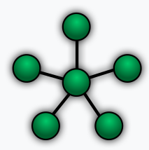
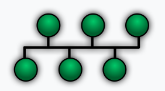
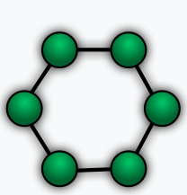
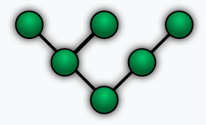

# Networking topologies

## Toplogies

### Point-to-point

- Diffusion: point-to-point

---

### Mesh

- Diffusion: point-to-point

---

### Star

- Diffusion: point-to-point

---

### Bus

- Diffusion: Broadcast

---

### Ring

- Diffusion: Broadcast

---

### Tree

---

### Hybrid

- Mix between two or more topologies.

- Diffusion: point-to-point and/or broadcast

## Source

- https://www.geeksforgeeks.org
- https://simple.wikipedia.org
- le cours.