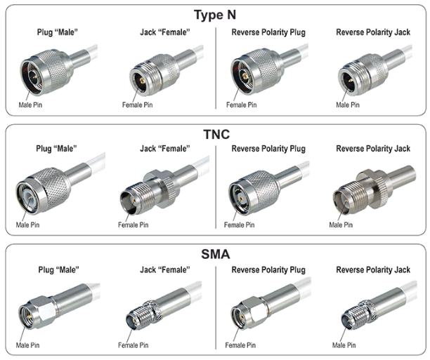

Un ensemble de câbles et de connecteurs différents dont l'objectif est d'établir une connexion série.
```
Câbles série
```


Câbles qui servaient à faire transiter les appels téléphoniques.
```
Câbles téléphoniques
```


Câbles de connexion très rapides, efficaces sur de longues distances, souvent utilisés pour les réseaux WAN ou les data centers.
```
Fibres optiques
```


Câbles souvent utilisés pour le transfert de signaux électriques à haute fréquence.
```
Câbles coaxiaux
```


Câbles qui utilisent les connecteurs RJ-11.
```
Câbles téléphoniques
```


Deux types de câbles connus qui utilisent le protocole Ethernet.
```
- Câbles Ethernet
- Fibres optiques
```

Ce câble est ?

```
Un câble de console
```

Ce câble est ?

```
une fibre optique
```

Ces câbles sont tous ?

```
Des câbles coaxiaux
```