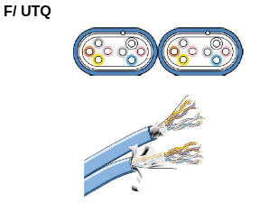

En ce qui concerne le câblage interne des câbles Ethernet, quelle est la norme à suivre ? (Une norme principale et deux sous-normes)
```
EIA/TIA-568
1. T-568A
2. T-568B
```

Donne l'ordre des couleurs de la norme T-568A.
```
G/ G O/ B B/ O Br/ Br
```

Donne l'ordre des couleurs de la norme T-568B.
```
O/ O G/ B B/ G Br/ Br
```

Dans le cas d'un câble Ethernet croisé, pour chacun des côtés du câble, donne la norme, soit T-568A ou B.
```
T-568A & T-568B
```

Dans le cas d'un câble Ethernet droit, pour chacun des côtés du câble, donne la norme, soit T-568A ou B.
```
2x T-568B
```

Donne la signification et les fonctionnalités d'un câble Ethernet U / UTP.
```
Unshielded / Unshielded Twisted Pairs

- Paires torsadées non blindées

```


Donne la signification et les fonctionnalités d'un câble Ethernet F / UTP.
```
Foiled / Unshielded Twisted Pairs

- Paires torsadées non blindées
- Écran global

```


Donne la signification et les fonctionnalités d'un câble Ethernet U / FTP.
```
Unshielded / Foiled Twisted Pairs

- Paires torsadées non blindées
- Un écran par paires

```


Donne la signification et les fonctionnalités d'un câble Ethernet F / FTP.
```
Foiled / Foiled Twisted Pairs

- Paires torsadées non blindées
- Écran global
- Un écran par paires

```


Donne la signification et les fonctionnalités d'un câble Ethernet S / FTP.
```
Shielded / Foiled Twisted Pairs

- Paires torsadées blindées
- Tresse globale
- Un écran par paires

```


Donne la signification et les fonctionnalités d'un câble Ethernet F / UTQ.
```
Foiled / Unshielded Twisted Quad

- Paires torsadées non blindées
- Écran global
- Structure en quadruples

```


Donne toutes les catégories de câbles Ethernet possibles.
```
- 3
- 5e
- 6
- 6a
- 7
```

Donne quatre choses à ne surtout pas faire avec les câbles Ethernet sous risque de casser le câble.
```
- Plier trop le câble.
- Serrer trop fort le câble.
- Appliquer une torsion excessive sur le câble.
- Faire supporter un poids excessif par le câble.

```

Donne une chose à ne surtout pas faire avec les câbles Ethernet sous risque d'interférences.
```
- Ne pas placer le câble trop près de sources électriques/électromagnétiques.
```

Quelle est la longueur maximale d'un câble Ethernet ? En théorie et en pratique.
```
- 100m
- 70m-90m en pratique.
```