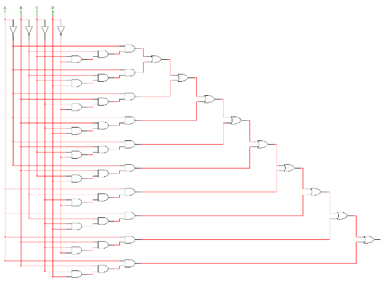
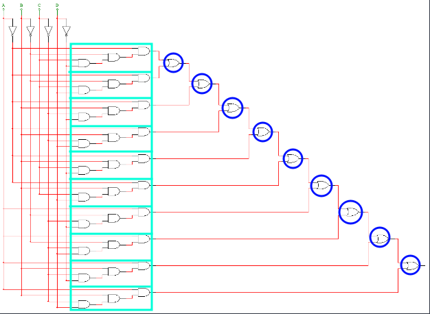
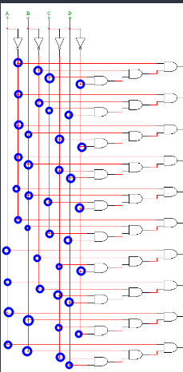
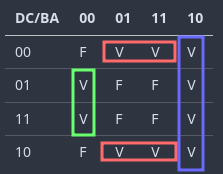
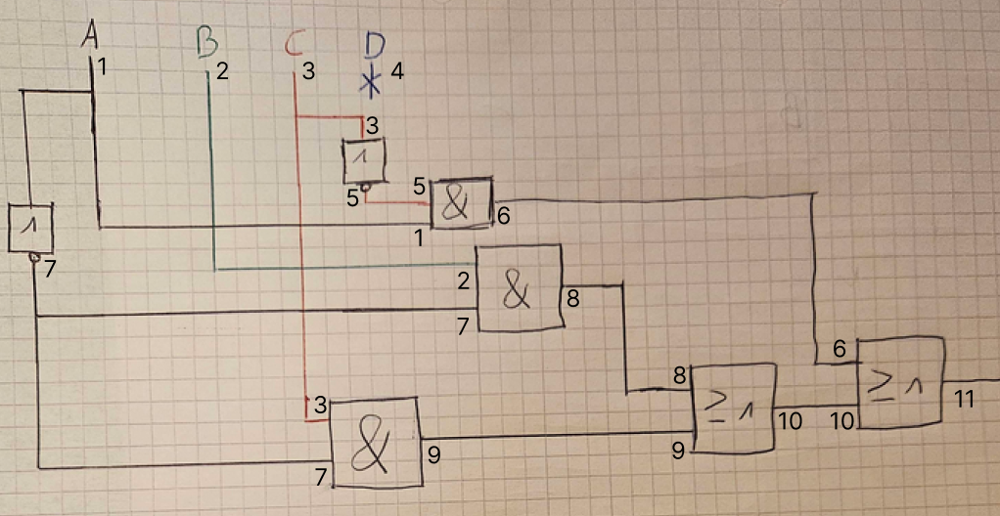
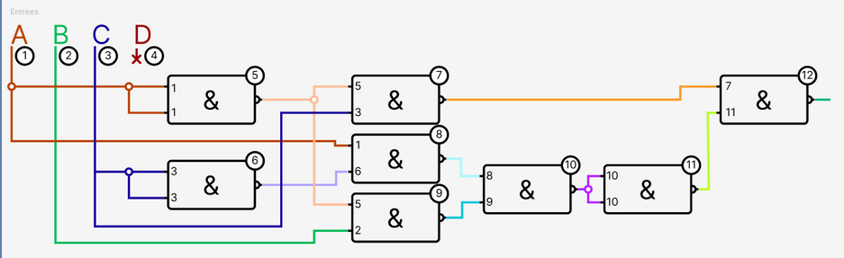
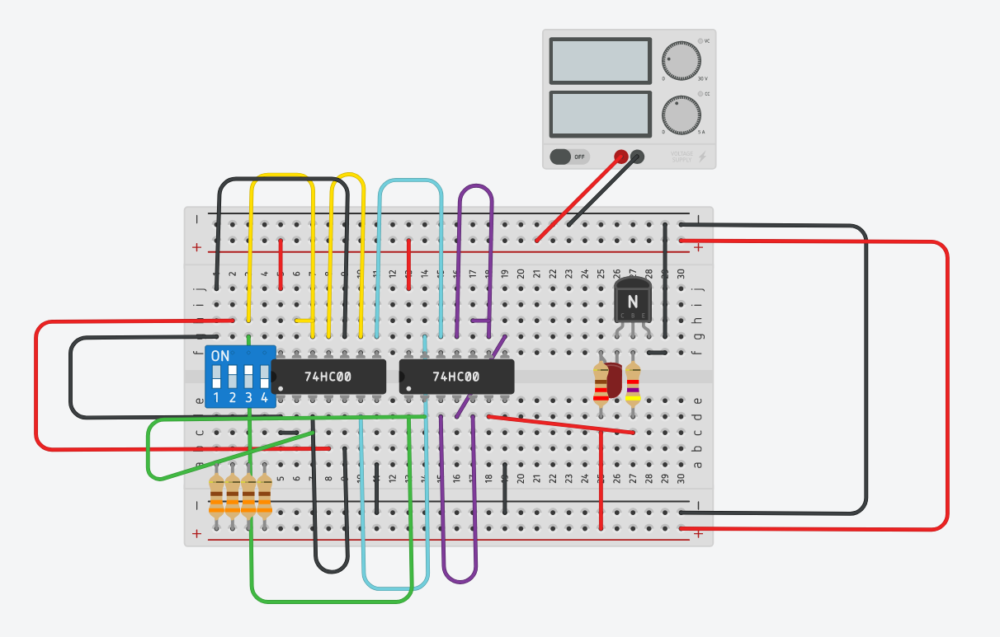
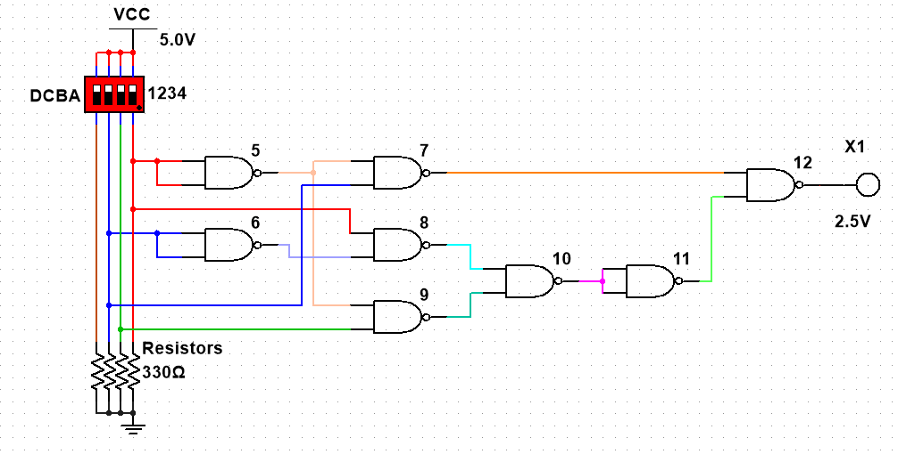

# Techniques Numeriques: TP QUAD-1 Projet

## Original structure

## Get the Formula !

### Look for paterns

- ... + ... + ... + ... + ... + ... + ... + ... + ... + ...

### Write down the entries for every 'AND'

- -A.-B.C.-D + -A.-B.C.D + -A.B.-C.-D + -A.B.-C.D + -A.B.C.-D + -A.B.C.D + A.-B.-C.-D + A.-B.-C.D + A.B.-C.-D + A.B.-C.D

### Simplification

1. Froming couples for distributibity
    1. -A.-B.C.**-D** + -A.-B.C.**D** = -A.-B.C
    2. -A.B.-C.**-D** + -A.B.-C.**D** = -A.B.-C
    3. -A.B.C.**-D** + -A.B.C.**D** = -A.B.C
    4. A.-B.-C.**-D** + A.-B.-C.**D** = A.-B.-C
    5. A.B.-C.**-D** + A.B.-C.**D** = A.B.-C

    - -A.-B.C + -A.B.-C + -A.B.C + A.-B.-C + A.B.-C

2. Forming couples for distributivity
    1. Keep "-A.-B.C"
    2. -A.B.-C + -A.B.C = -A.B
    3. A.-B.-C + A.B.-C = A.-C

    - -A.B + A.-C + -A.-B.C

3. Applying distributivity on a last couple
    1. Keep "A-C"
    2. -A.B + -A.-B.C = -A(B + -B.C)
    3. = -A(B + C)
    4. = -AB + -AC

    - -AB + -AC + A-C

## Truth table

| n° | D | C | B | A | Result | -AB + -AC + A-C |
| -- | - | - | - | - | ------ | --------------- |
| 1  | 0 | 0 | 0 | 0 |      F | -00 + -00 + 0-0 |
| 2  | 0 | 0 | 0 | 1 |      V | -10 + -10 + 1-0 |
| 3  | 0 | 0 | 1 | 0 |      V | -01 + -00 + 0-0 |
| 4  | 0 | 0 | 1 | 1 |      V | -11 + -10 + 1-0 |
| 5  | 0 | 1 | 0 | 0 |      V | -00 + -01 + 0-1 |
| 6  | 0 | 1 | 0 | 1 |      F | -10 + -11 + 1-1 |
| 7  | 0 | 1 | 1 | 0 |      V | -01 + -01 + 0-1 |
| 8  | 0 | 1 | 1 | 1 |      F | -11 + -11 + 1-1 |
| 9  | 1 | 0 | 0 | 0 |      F | -00 + -00 + 0-0 |
| 10 | 1 | 0 | 0 | 1 |      V | -10 + -10 + 1-0 |
| 11 | 1 | 0 | 1 | 0 |      V | -01 + -00 + 0-0 |
| 12 | 1 | 0 | 1 | 1 |      V | -11 + -10 + 1-0 |
| 13 | 1 | 1 | 0 | 0 |      V | -00 + -01 + 0-1 |
| 14 | 1 | 1 | 0 | 1 |      F | -10 + -11 + 1-1 |
| 15 | 1 | 1 | 1 | 0 |      V | -01 + -01 + 0-1 |
| 16 | 1 | 1 | 1 | 1 |      F | -11 + -11 + 1-1 |

### Canonical form
| n° | D | C | B | A | Result | -AB + -AC + A-C |
| -- | - | - | - | - | ------ | --------------- |
| 2  | 0 | 0 | 0 | 1 |      V | -10 + -10 + 1-0 |
| 3  | 0 | 0 | 1 | 0 |      V | -01 + -00 + 0-0 |
| 4  | 0 | 0 | 1 | 1 |      V | -11 + -10 + 1-0 |
| 5  | 0 | 1 | 0 | 0 |      V | -00 + -01 + 0-1 |
| 7  | 0 | 1 | 1 | 0 |      V | -01 + -01 + 0-1 |
| 10 | 1 | 0 | 0 | 1 |      V | -10 + -10 + 1-0 |
| 11 | 1 | 0 | 1 | 0 |      V | -01 + -00 + 0-0 |
| 12 | 1 | 0 | 1 | 1 |      V | -11 + -10 + 1-0 |
| 13 | 1 | 1 | 0 | 0 |      V | -00 + -01 + 0-1 |
| 15 | 1 | 1 | 1 | 0 |      V | -01 + -01 + 0-1 |

- -D-C-BA + -D-CB-A + -D-CBA + -DC-B-A + -DCB-A + D-C-BA + D-CB-A + D-CBA + DC-B-A + DCB-A 

## Canonical form 2
| n° | D | C | B | A | Result | -AB + -AC + A-C |
| -- | - | - | - | - | ------ | --------------- |
| 1  | 0 | 0 | 0 | 0 |      F | -00 + -00 + 0-0 |
| 6  | 0 | 1 | 0 | 1 |      F | -10 + -11 + 1-1 |
| 8  | 0 | 1 | 1 | 1 |      F | -11 + -11 + 1-1 |
| 9  | 1 | 0 | 0 | 0 |      F | -00 + -00 + 0-0 |
| 14 | 1 | 1 | 0 | 1 |      F | -10 + -11 + 1-1 |
| 16 | 1 | 1 | 1 | 1 |      F | -11 + -11 + 1-1 |

- -D-C-B-A + -DC-BA + -DCBA + D-C-B-A + DC-BA + DCBA

> to get the truth table, we had to test every possibilities with the formula "-AB + -AC + A-C" we've got earlier.

## Karnaugh Table

| DC/BA | 00 | 01 | 11 | 10 |
| ----- | -- | -- | -- | -- |
|    00 |  F |  V |  V |  V |
|    01 |  V |  F |  F |  V |
|    11 |  V |  F |  F |  V |
|    10 |  F |  V |  V |  V |

### Getting the formula from Karnaugh's Table

- A-C-D + -AB + A-CD + -A-BC

#### Simplification
- A-C(-D + D) + -AB + -A-BC
- A-C + -AB + -A-BC
- A-C + -A(B + -BC)
- A-C + -A(B + C)
- A-C + -AB + -AC

## OR AND schema (EURO)

### NANDification

+ A-C + -AB + -AC

1. Annulation

+ -(-(A-C + -AB + -AC))

2. De Morgan

+ -( -(A-C) . -(-AB) . -(-AC) )

3. Associativity

+ -( ( -(A-C) . -(-AB) ) . -(-AC) )
+ -(A-C) = X
+ -(-AB) = Y
+ -(-AC) = Z
+ -( (X . Y) . Z )

4. Annulation

+ -(-(-( (X . Y) . Z )))

5. De Morgan

+ -( --(X . Y) . Z )
+ H = -(X . Y)
+ -( -H . Z )

+ -( --(-(A-C) . -(-AB)) . -(-AC) )

6. Transforming to NAND2

+ NAND(H) NAND Z
+ NAND(X NAND Y) NAND (NAND(A) NAND C)
+ NAND((A NAND NAND(C)) NAND (NAND(A) NAND B)) NAND (NAND(A) NAND C)

> X NAND Y == $-(X.Y)$ == $-X + -Y$

### Testing NAND2

| D   | C | B | A | Result |
| --- | - | - | - | ------ |
| 0/1 | 0 | 0 | 0 |      F | 0
| 0/1 | 0 | 0 | 1 |      V | 1
| 0/1 | 0 | 1 | 0 |      V | 1
| 0/1 | 0 | 1 | 1 |      V | 1
| 0/1 | 1 | 0 | 0 |      V | 1
| 0/1 | 1 | 0 | 1 |      F | 0
| 0/1 | 1 | 1 | 0 |      V | 1
| 0/1 | 1 | 1 | 1 |      F | 0

- 000: 0
- 100: 1
- 010: 1
- 110: 1
- 001: 1
- 101: 0
- 011: 1
- 111: 1

## NAND2 Schema

### NAND2 sur Tinckercad

### NAND2 sur Multisim
