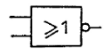

Que fait l'opérateur logique NOT ?
```
Il prend une entrée et retourne la valeur opposée de cette entrée.
```

Quel est l'opérateur logique qui retourne la valeur opposée de l'entrée ?
```
NOT
```

Quel est cet opérateur ? (USA)


```
NOT
```

Quel est cet opérateur ? (Europe)


```
NOT
```

Que fait l'opérateur logique AND ?
```
Il prend deux entrées et retourne vrai si les deux entrées sont vraies.
```

Quel est l'opérateur logique qui retourne vrai si les deux entrées sont vraies ?
```
AND
```

Quel est cet opérateur ? (USA)


```
AND
```

Quel est cet opérateur ? (Europe)


```
AND
```

Que fait l'opérateur logique OR ?
```
Il prend deux entrées et retourne vrai si au moins l'une des deux entrées est vraie.
```

Quel est l'opérateur logique qui retourne vrai si au moins l'une des deux entrées est vraie ?
```
OR
```

Quel est cet opérateur ? (USA)


```
OR
```

Quel est cet opérateur ? (Europe)


```
OR
```

Que fait l'opérateur logique NAND ?
```
Il prend deux entrées et retourne vrai si les deux entrées ne sont pas actives en même temps.
```

Quel est l'opérateur logique qui retourne vrai si les deux entrées ne sont pas actives en même temps ?
```
NAND
```

Quel est cet opérateur ? (USA)


```
NAND
```

Quel est cet opérateur ? (Europe)


```
NAND
```

Que fait l'opérateur logique NOR ?
```
Il prend deux entrées et retourne vrai si aucune des deux entrées n'est vraie.
```

Quel est l'opérateur logique qui retourne vrai si aucune des deux entrées n'est vraie ?
```
NOR
```

Quel est cet opérateur ? (USA)


```
NOR
```

Quel est cet opérateur ? (Europe)


```
NOR
```

Que fait l'opérateur logique XOR ?
```
Il prend deux entrées et retourne vrai si une et seulement une des deux entrées est vraie.
```

Quel est l'opérateur logique qui retourne vrai si une et seulement une des deux entrées est vraie ?
```
XOR
```

Quel est cet opérateur ? (USA)


```
XOR
```

Quel est cet opérateur ? (Europe)


```
XOR
```

Que fait l'opérateur logique XNOR ?
```
Il prend deux entrées A et B et retourne vrai si A est égal à B.
```

Quel est l'opérateur logique qui retourne vrai si A est égal à B ?
```
XNOR
```

Quel est cet opérateur ? (USA)


```
XNOR
```

Quel est cet opérateur ? (Europe)


```
XNOR
```