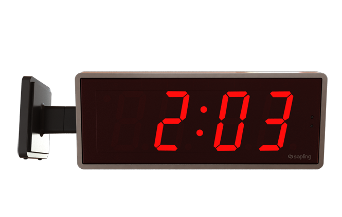

# Differences between digital and analog

### Analog

- The value is always changing with "Infinite" precision.

Example: analog clock. You can zoom to "Infinite" if you want more precise numbers.

### Digital

- The values are precise, and there is a limit to the precision.

Example: digital clock. There is no 2:03:xx:xx:...

Example: binary, there is no 0.5 in binary, just 1 or 0.

101010111010100001010