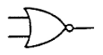
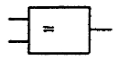

# Logical Operators

### NOT

- An input $A$ returns the opposite of A.

- Notation: $\overline{A} = ....$

#### Representation:
| USA | Europe |
| --- | ------ |
|  |  |

---

### AND

- Two inputs $A, B$, if both inputs are true, then the output is true.

- Notation: $A.B = ...$

#### Representation:
| USA | Europe |
| --- | ------ |
|  |  |

---

### OR / Inclusive OR

- Two inputs $A, B$, if either one or both inputs are true, then the output is true.

- Notation: $A+B = ...$

#### Representation:

| USA | Europe |
| --- | ------ |
|  |  |

---

### NAND

- Two inputs $A, B$, if both inputs are not active at the same time, then the output is true.

- Notations: $\overline{A.B}$ or  $\overline{A} + \overline{B}$

#### Representation
| USA | Europe |
| --- | ------ |
|  |  |

---

### NOR

- Two inputs $A, B$, if neither input is true, then the output is true.

- Notations: $\overline{A+B}$ or $\overline{A}.\overline{B}$

#### Representation
| USA | Europe |
| --- | ------ |
|  |  |

---

### XOR / Exclusive OR

- Two inputs $A, B$, if either of the two inputs is true, then the output is true.

- Notations: $A⊕B$ or $A.\overline{B} + \overline{A}.B$ 

#### Representation
| USA | Europe |
| --- | ------ |
|  |  |

---

### XNOR / Equality

- Two inputs $A, B$, if A == B, then the output is true.

- Notations: $\overline{A⊕B}$ or $\overline{A.B} + A.B$

| USA | Europe |
| --- | ------ |
|  |  |